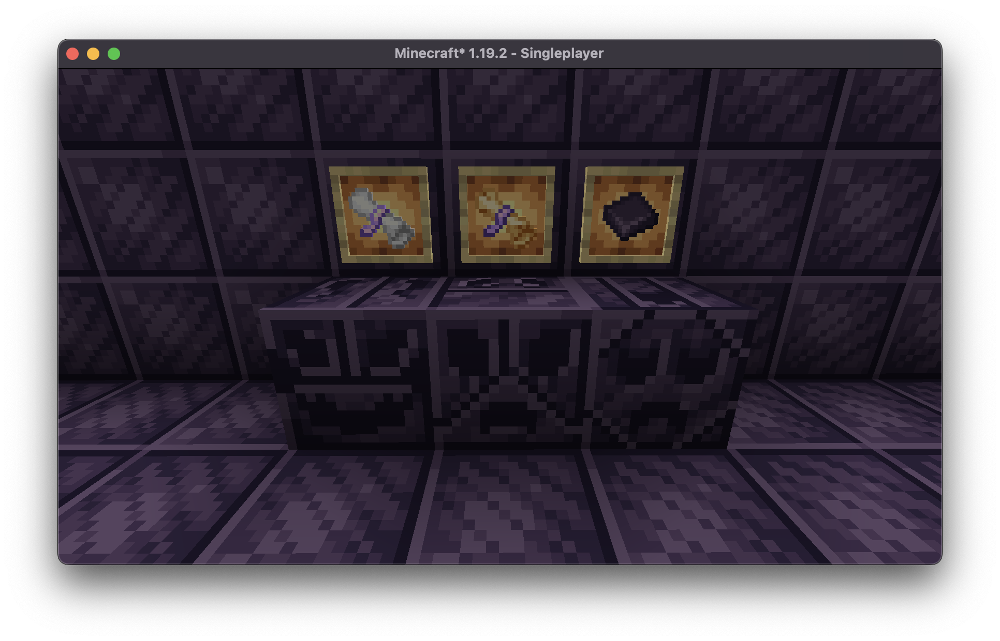
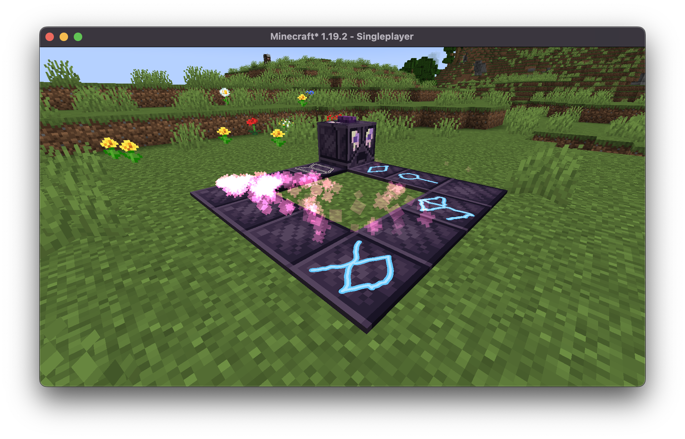
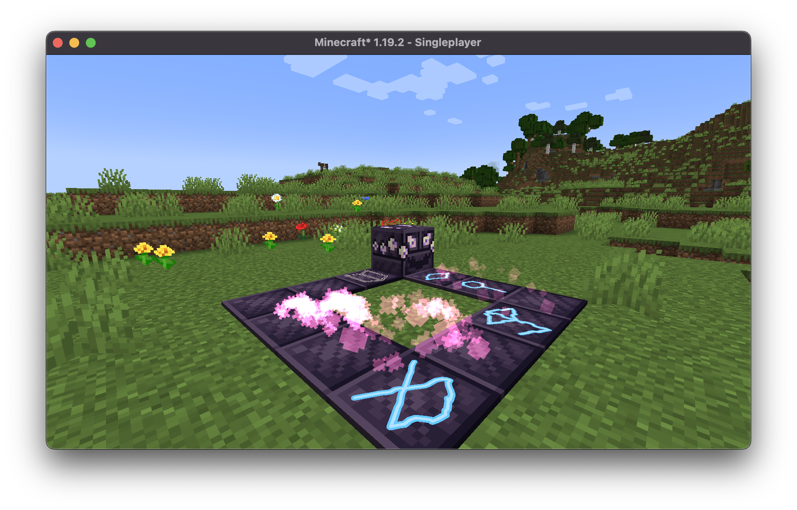
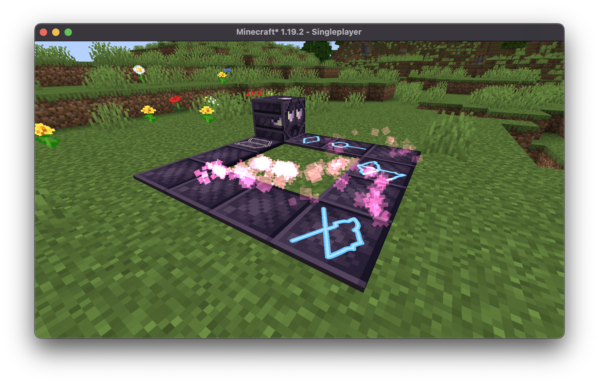

# Hexture Backport

A resource pack backporting 1.20 [Hex Casting](https://github.com/gamma-delta/HexMod) textures to 1.19.2 hex.

All of these wonderful textures were made by falkory and will be available in the 1.20 release of hexcasting !

## Gallery

